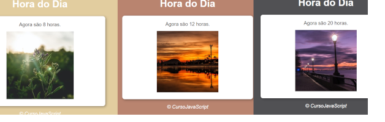

Site que mostra a hora do dia.

Foi criado um arquivo modelo.html.

Foi criado um arquivo estilo.css que configura o estilo do site no cabeçalho, 
corpo e rodapé como a cor inicial do fundo, a fonte do texto, a cor do texto, 
o alinhamento do texto, distanciamento do texto com imagem.

Foi criado um arquivo script.js que faz a interação com o usuário. 
Pega o horário do momento atual e mostra uma imagem com fundo alterado. No 
caso se a hora for 0 a 12 mostra a imagem fotomanha, se a hora for de 12 a
18 mostra a imagem fototarde senão mostra a fotonoite. 

    

